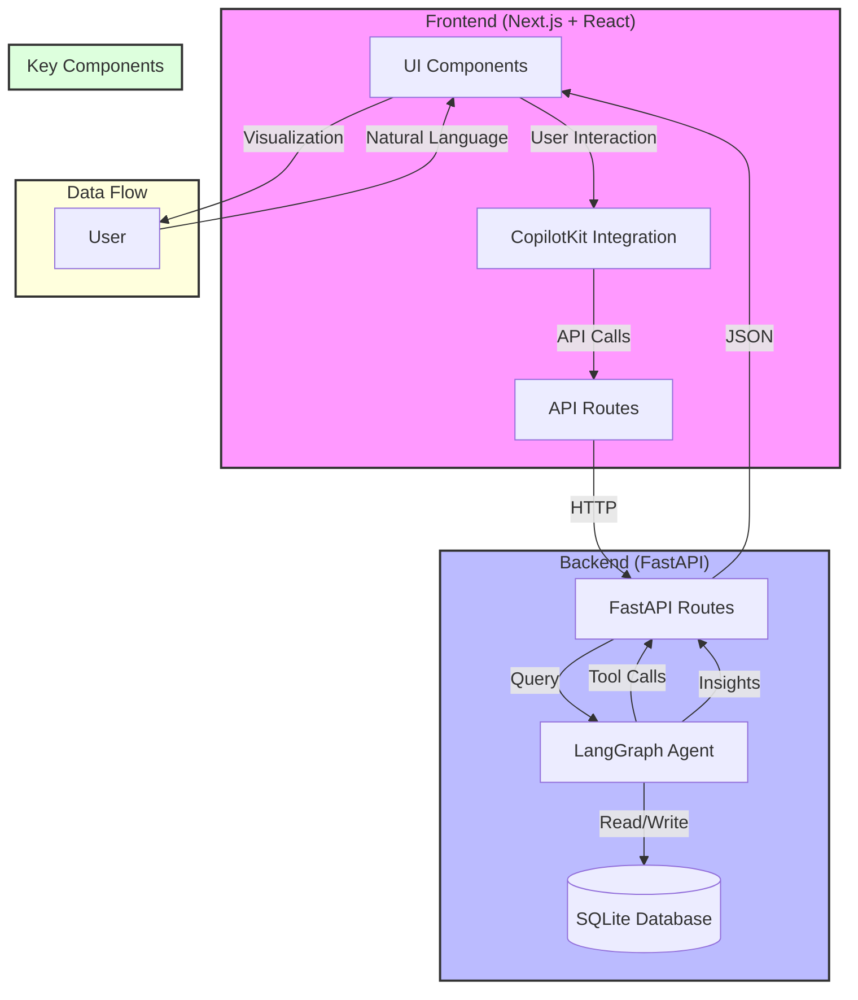

# insight-copilot

## Introduction
A modular, open-source Co-Pilot app built with LangGraph and CopilotKit. InsightCopilot enables natural language querying and real-time data visualization for structured dataset.
Forked from open source repo: https://github.com/al-mz/insight-copilot


## System Architecture

The InsightCopilot system is built with a modern, modular architecture that separates concerns between frontend and backend components while maintaining seamless integration through well-defined APIs.



## Key Features

- **Natural Language Data Querying**: Ask questions about your data in plain English
- **Intelligent Assistant**: Powered by LangGraph for context-aware responses
- **Low-Code Integration**: Connect to your own datasets with minimal configuration
- **Extensible Architecture**: Add new visualization types and query capabilities

## Technology Stack

### Backend
- **FastAPI**: High-performance API framework
- **LangGraph**: For building AI agent workflows
- **SQLAlchemy**: ORM for database interactions
- **SQLite**: Local database storage

### Frontend
- **Next.js**: React framework for production
- **CopilotKit**: UI components for AI assistants
- **Tailwind CSS**: Utility-first CSS framework
- **Recharts**: Flexible charting library

## Installation Options

### Option 1: Docker Installation (Recommended)

#### Prerequisites
- Docker
- Docker Compose

#### Setup
1. Clone the repository:
```bash
git clone https://github.com/shinelin-samuel/copilot-dashboard
cd copilot-dashboard
```

2. Create a `.env` file in the root directory:
```bash
cp .env.sample .env
# Edit .env and add your OpenAI API key
```

3. Build and start the containers:
```bash
docker-compose up --build
```

4. Access the application:
- Frontend: http://localhost:3000
- Backend API: http://localhost:8000
- API Documentation: http://localhost:8000/docs

### Option 2: Local Installation

#### Backend Setup

##### Prerequisites
- Python 3.8+
- SQLite3
- UV package manager

##### Installation
1. Create and activate a virtual environment:
```bash
python -m venv .venv
source .venv/bin/activate  # On Windows: .venv\Scripts\activate
```

2. Install dependencies using UV:
```bash
uv pip install -r backend/requirements.txt
```

##### Database Setup
The backend uses SQLite with the Sakila sample database. The database file will be automatically created in `backend/data/sqlite-sakila.db` when you first run the application.

##### Running the Backend
1. Start the FastAPI server:
```bash
uvicorn backend.app.main:app --reload
```

2. Access the API documentation:
- Swagger UI: http://localhost:8000/docs
- ReDoc: http://localhost:8000/redoc

#### Frontend Setup

##### Prerequisites
- Node.js 18+
- pnpm

##### Installation
1. Navigate to the frontend directory:
```bash
cd frontend
```

2. Create a `.env.local` file with the following environment variables:
```bash
# For local development
NEXT_PUBLIC_API_URL=http://localhost:8000
SERVER_API_URL=http://localhost:8000
AWS_ACCESS_KEY_ID=your_access_key
AWS_SECRET_ACCESS_KEY=your_secret_key
```

3. Install dependencies:
```bash
pnpm install
```

##### Running the Frontend
1. Start the development server:
```bash
pnpm run dev
```

2. Access the application:
- Open http://localhost:3000 in your browser

### Environment Variables

#### Docker Setup
The following environment variables are automatically set in the Docker Compose configuration:
- `NEXT_PUBLIC_API_URL=http://localhost:8000` - Used by the frontend for client-side API calls
- `SERVER_API_URL=http://backend:8000` - Used by the server-side CopilotKit runtime
- `AWS_ACCESS_KEY_ID` - Your AWS Access key (set in .env file)
- `AWS_SECRET_ACCESS_KEY` - Your AWS Secret Access key (set in .env file)

#### Local Setup
For local development, you need to set these variables in your `.env.local` file:
- `NEXT_PUBLIC_API_URL=http://localhost:8000` - Used by the frontend for client-side API calls
- `SERVER_API_URL=http://localhost:8000` - Used by the server-side CopilotKit runtime
- `AWS_ACCESS_KEY_ID` - Your AWS Access key (set in .env file)
- `AWS_SECRET_ACCESS_KEY` - Your AWS Secret Access key (set in .env file)

### Development Features
- Hot reloading for instant feedback
- TypeScript support for type safety
- Tailwind CSS for styling
- CopilotKit integration for AI-powered features

## Development

### Project Structure
```
InsightCopilot/
├── backend/
│   ├── app/
│   │   ├── __init__.py
│   │   ├── main.py          # Entry point for FastAPI
│   │   ├── api/
│   │   │   ├── __init__.py
│   │   │   ├── query.py     # Handles query endpoints
│   │   │   └── insights.py  # Handles insights endpoints
│   │   ├── db/
│   │   │   ├── __init__.py
│   │   │   ├── database.py  # SQLite connection and schema setup
│   │   │   └── models.py    # SQLAlchemy ORM models for Sakila DB
│   │   ├── agent/
│   │   │   ├── __init__.py
│   │   │   ├── configuration.py  # Agent configuration settings
│   │   │   ├── graph.py         # LangGraph workflow definition
│   │   │   ├── langgraph.json   # LangGraph configuration
│   │   │   ├── prompts.py       # Agent prompts and templates
│   │   │   ├── state.py         # State management for the agent
│   │   │   ├── tools.py         # Custom tools for the agent
│   │   │   └── utils.py         # Agent-specific utilities
│   │   └── utils/
│   │       └── helpers.py   # Utility functions (data processing, query generation, etc.)
│   ├── data/
│   │   ├── sqlite-sakila.db   # Sample SQLite database
│   │   └── README.txt        # Database documentation
│   ├── tests/
│   │   ├── test_api.py      # API endpoint tests
│   │   └── test_langgraph.py # Agent logic tests
│   ├── requirements.txt     # Project dependencies
│   └── pyproject.toml       # Python project configuration
│
├── frontend/
│   ├── app/
│   │   ├── api/
│   │   │   └── copilotkit/
│   │   │       └── route.ts  # API route for CopilotKit
│   │   ├── globals.css      # Global styles including Tailwind
│   │   ├── layout.tsx       # Root layout with CopilotKit provider
│   │   └── page.tsx         # Entry point for the application
│   ├── components/
│   │   ├── AssistantMessage.tsx  # Custom assistant message component
│   │   ├── Dashboard.tsx         # Main dashboard with visualizations
│   │   ├── Header.tsx            # App header component
│   │   ├── generative-ui/        # UI components for generative features
│   │   └── ui/                   # Reusable UI components
│   │       ├── area-chart.tsx    # Area chart visualization
│   │       ├── bar-chart.tsx     # Bar chart visualization
│   │       ├── card.tsx          # Card container component
│   │       ├── pie-chart.tsx     # Pie/donut chart visualization
│   │       └── ...               # Other UI components
│   ├── lib/
│   │   ├── prompt.ts         # Prompts for CopilotKit
│   │   └── utils.ts          # Utility functions
│   ├── public/
│   │   └── favicon.ico
│   ├── eslint.config.mjs     # ESLint configuration
│   ├── next.config.mjs       # Next.js configuration
│   ├── package.json          # Frontend dependencies
│   ├── postcss.config.mjs    # PostCSS configuration for Tailwind
│   ├── tailwind.config.ts    # Tailwind CSS configuration
│   └── tsconfig.json         # TypeScript configuration
│
├── .env.example             # Environment variable template
├── .gitignore               # Ignored files
├── README.md                # Project overview and setup instructions
├── docker-compose.yml       # Docker configuration for backend and frontend
├── LICENSE                  # Open-source license
└── Makefile                 # Common project commands (setup, run, test)
